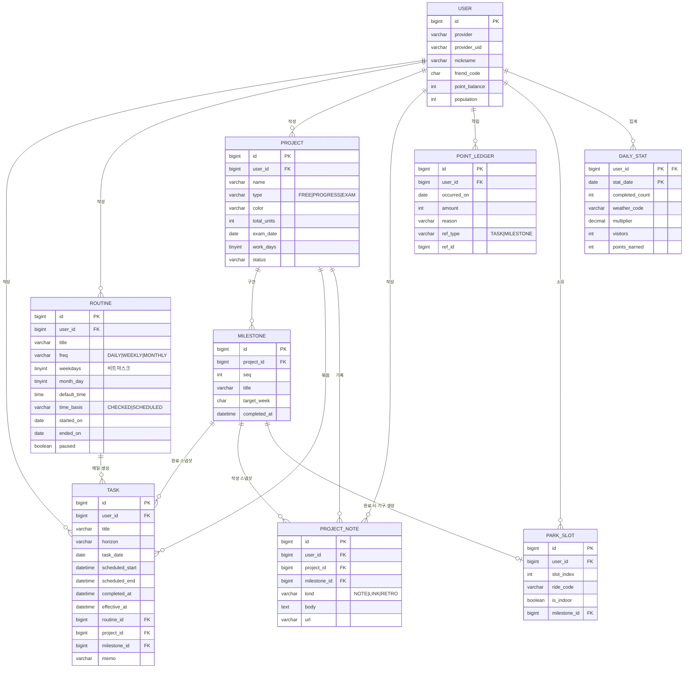

# ERD

`V1` ~ `V6` 마이그레이션 기준. 실제 구현된 스키마만 반영하며, 새 마이그레이션이 추가될 때마다 갱신한다.
전체 계획(친구·같이하기·외부 캘린더 등 미구현 테이블 포함)은 `product-spec.md`의 B-3을 참조.

## 참고

- `TASK.routine_id` / `TASK.project_id` / `TASK.milestone_id`는 전부 `NULL` 허용 — 반복도 프로젝트도 아닌 일반 할 일이 기본값
- `MILESTONE.completed_at`이 채워지는 순간(`ProjectService.completeMilestone`) `PARK_SLOT` 한 행이 같이 생긴다 — "마일스톤 1개 완료 = 기구 1개" 규칙(A-6-6)
- `DAILY_STAT`은 기본키가 `(user_id, stat_date)` 복합키. 완료 이벤트마다 그날 행을 다시 계산해서 갱신한다
- `POINT_LEDGER.UNIQUE(user_id, ref_type, ref_id)` — 같은 완료 이벤트로 포인트가 중복 지급되지 않도록 막는 제약 (B-4)
